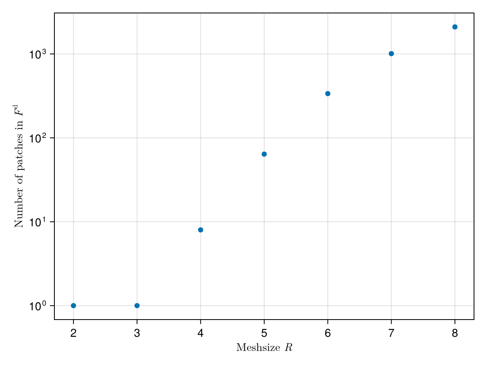
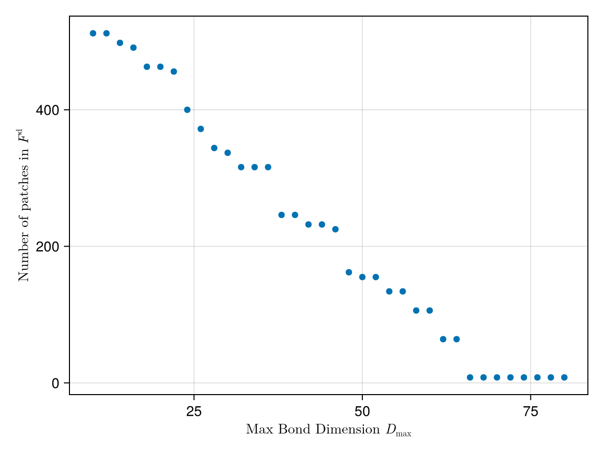

# Bethe-Salpeter equation in QTCI representation with patches (TODO: Title OK?, QTCI or QTT?)

## Bethe-Salpeter equation

Our objective in this work is computing the Bethe-Salpeter equation (BSE), which relates the full vertex $F^r$, the bare susceptibility ${X^0}^r$ and the channel-irreducible vertex $\Gamma^r$
$$
    F^r_{\nu\nu'\omega} = \Gamma^r_{\nu\nu'\omega} + \frac{1}{\beta^2}\sum_{\nu''\nu'''} F^r_{\nu\nu''\omega} {X^0}^r_{\nu''\nu'''\omega} \Gamma^r_{\nu'''\nu'\omega}.
$$
The sum term is equal to the channel-reducible vertex $\Phi^r \equiv F^r_{\nu\nu'\omega} - \Gamma^r_{\nu\nu'\omega}$.
Here, $r$ denotes one of four (density $r=d$, magnetic $r=m$, singlet $r=s$, triplet $r=t$) channels, $\nu$ (and its primed variants) a fermionic Matsubara frequency (of the form $(2n+1)\pi/\beta$ for some integer $n$) and $\omega$ a bosonic Matsubara frequency (of the form $2m\pi/\beta$ for some integer $m$).
The sums are performed over all fermionic frequencies and $\beta = 1/T$ is inverse temperature.

If we chose to straightforwardly represent our quantities by sampling them in a box centered on the origin, the BSE would be easy to implement: For each bosonic frequency, two matrix-matrix multiplications would suffice.
But as this strategy sooner rather than later hits a wall in terms of computing power and memory requirements when approaching lower temperatures, where a larger frequency box is required to yield the same accuracy target in the BSE, people have been looking for alternative solutions for some time. (TODO: sources)

## Quantics tensor trains

In the present work, we utilize a quantics tensor train (QTT) representation [@Shinaoka2023].
A function of a single Matsubara frequency $f_\nu$ can be approximately represented by its values on a $2^R$-frequency mesh $\nu \in \{\pi/\beta, 3\pi/\beta, \ldots, (2^{R+1} - 1)\pi/\beta\}$ (in practice, the frequency box is usually centered on the origin) where $R \in \mathbb{N}$ controls the accuracy of the representation.
Each such $\nu$ can be written as
$$
    \nu = \left(\nu_1 2^R + \nu_2 2^{R-1} + \ldots + \nu_R + 1\right)\pi/\beta
$$
where the $\nu_r \in \{0, 1\}$ are binary variables.
Thus $f$ can be viewed as an order-$R$ tensor,
$$
    f_\nu = f_{\nu_1\nu_2\ldots\nu_R}
$$
which then allows us to perform SVD and convert it into a tensor train (also known as multi-particle state or MPS)
$$
    f_{\nu_1\nu_2\ldots\nu_R} \approx \sum_{\alpha_1=1}^{D_1} \cdots \sum_{\alpha_{R-1}=1}^{D_{R-1}} f^{(1)}_{\nu_1,1\alpha_1} f^{(2)}_{\nu_2,\alpha_1\alpha_2} \cdots f^{(R)}_{\nu_R,\alpha_{R-1}1}. 
$$
Here, $f^{(r)}_{\nu_r,\alpha_{r-1}\alpha_{r}}$ is a $2 \times D_{r-1} \times D_r$ tensor and $D_r$ is the bond dimension between two neighboring tensors.
We call $\alpha_r$ the bond (or internal) indices, $\nu_r$ the local (or external) indices and $D = \max_r D_r$ the tensor train's bond dimension.
If it is high enough, $D \sim 2^R$, the tensor is represented exactly, but to compress the original function, we can truncate the tensor and throw away unimportant information.
We will not go into the details of how to find the tensor train representation here, but suffice it to say we employ Tensor cross interpolation (TCI) [@Ritter2024].

### Multi-particle operators

A very similar concept is that of an multi-particle operator (MPO), which consists of order 4 tensors and has two external indices per tensor.
As the name implies, an MPO can be multiplied onto an MPS (or another MPO), being analogous to a matrix if MPSs are viewed as analogous to vectors:
$$
\begin{aligned}
    (A \cdot f)_{\nu_1\ldots\nu_R} &= \sum_{\nu_1',\ldots,\nu_R'} A^{(1),\nu_1'}_{\nu_1} \cdot \ldots \cdot A^{(R),\nu_R'}_{\nu_R} f^{(1)}_{\nu_1'} \cdot \ldots \cdot f^{(R)}_{\nu_R'} \\
    &= \sum_{\nu_1',\ldots,\nu_R'} \sum_{\alpha_{A,1},\ldots,\alpha_{A,R}} \sum_{\alpha_{f,1},\ldots,\alpha_{f,R}} A^{(1),\nu_1'}_{\nu_1,1\alpha_{A,1}} f^{(1)}_{\nu_1',1\alpha_{f,1}} \cdots A^{(R),\nu_R'}_{\nu_R,\alpha_{A,R}1} f^{(R)}_{\nu_R',\alpha_{f,R}1}
\end{aligned}
$$

### Multiple variables

To form the MPS of a multivariate function $f_{\nu\nu'}$, we have two choices:

- Interleaved representation: $2R$ tensors of dimension $2 \times D_{r-1} \times D_r$.
    $$
        f_{\nu\nu'} \approx \sum_{\alpha_1=1}^{D_1} \cdots \sum_{\alpha_{2R-1}=1}^{D_{2R-1}} f^{(1)}_{\nu_1,1\alpha_1} f^{(2)}_{\nu_1',\alpha_1\alpha_2} f^{(3)}_{\nu_2,\alpha_2\alpha_3} f^{(4)}_{\nu_2',\alpha_3\alpha_4} \cdots f^{(2R-1)}_{\nu_R,\alpha_{2R-2}\alpha_{2R-1}} f^{(2R)}_{\nu_R',\alpha_{2R-1}1}
    $$
- Fused representation: $R$ tensors of dimension $4 \times D_{r-1} \times D_r$.
    $$
        f_{\nu\nu'} \approx \sum_{\alpha_1=1}^{D_1} \cdots \sum_{\alpha_{R-1}=1}^{D_{R-1}} f^{(1)}_{(\nu_1,\nu_1'),1\alpha_1} f^{(2)}_{(\nu_2,\nu_2'),\alpha_1\alpha_2} \cdots f^{(R)}_{(\nu_R,\nu_R'),\alpha_{R-1}1}
    $$

In the following, we will work in the fused representation.

### Multiplication (contraction) of MPSs

For clarity, we will use $i$, $j$ and $k$ in this section instead of $\nu$, $\nu'$ and $\nu''$.
To compute
$$
    h_{ij} = \sum_k f_{ik} g_{kj},
$$
we introduce an auxiliary MPO $\hat{f}$ such that
$$
    h_{ij} = \sum_{kl} \hat{f}^{kl}_{ij} g_{kl}
$$
which is given by
$$
    \hat{f}^{kl}_{ij} = \sum_{\alpha_1,\ldots,\alpha_{R_1}} \hat{f}^{(1),(k_1, l_1)}_{(i_1, j_1),1\alpha_1} \hat{f}^{(2),(k_2, l_2)}_{(i_2, j_2),\alpha_1\alpha_2} \cdots \hat{f}^{(R),(k_R, l_R)}_{(i_R, j_R),\alpha_{R-1}1}
$$
with
$$
    \hat{f}^{(r),(k_r, l_r)}_{(i_r, j_r),\alpha_{r-1}\alpha_r} = f^{(r)}_{(k_r, i_r),\alpha_{r-1}\alpha_r} \delta_{l_rj_r}.
$$
This enables us to use efficient MPO-MPS multiplication implementations.

### Adaptive patching

To more efficiently compress the information we handle, we choose a strategy of adaptive patching by setting an upper bound $D_\mathrm{max}$ to the bond dimension $D$.
For illustration, picture a function $f(x, y)$ on a square domain $[0, 1]^2$.
We generate via TCI an MPS approximating $f$ on a $R \times R$ mesh with a certain measure of precision, discarding rows/columns of its tensors such that the result is equal to $f$ to within a given tolerance.
Now, if the MPS's bond dimension exceeds $D_\mathrm{max}$, we divide the domain into 4 smaller squares (or "patches") and construct an MPS on each with $R' \times R'$ where $R' = R - 1$, reusing the exact same interpolation points as the original domain.
We repeat this process, recursively subdividing our domain until the bond dimensions of all MPSs is smaller than or equal to $D_\mathrm{max}$.

The idea here is that in this way, we resolve more finely regions of the domain where $f$'s complexity is higher and are able to limit the bond dimension in areas of lower complexity, saving memory.
Of course, on the other hand, now multiplication becomes more involved.
Although they live on the same domain, multiplier and multiplicand are in general going to consist of different patches, so when multiplying we iterate over both sets of patches and test for overlapping patches which can then be multiplied as usual.

## Demonstration

We would now like to demonstrate the discussed techniques.
To this end, we choose the Hubbard Atom (############## TODO: intro Hubbard model?), where exact expressions for all quantities are known [@Thunstroem:PRB18] and implemented in the package `HubbardAtoms.jl`.

A host of Julia packages is necessary:


```julia
import QuanticsGrids as QG     # utilities for handling quantics representations
import TCIAlgorithms as TCIA   # implementation of patching
using HubbardAtoms             # exact results for the Hubbard atom
using SparseIR                 # provides the MatsubaraFreq types used in the HubbardAtoms package
using Quantics                 # high-level API for performing operations in QTT
using ITensors                 # efficient tensor computations and tensor network calculations
```

We can now use `QuanticsGrids.jl` to create a grid in the shape of a $R \times R \times R$ cube almost centered on the origin of "fermionic × fermionic × bosonic" Matsubara frequency space.
"Almost", because by construction the grid consists of an even number of points ($2^R$) in each direction and bosonic Matsubara frequencies are even, so a grid centered on the origin would include an odd number of frequencies.
This is something that will not affect our calculations in this example however, because we never sum over the bosonic axis.
If we wanted to do that -- e.g. in implementing the Schwinger-Dyson equation -- special care would need to be taken.

Later, interoperation between `TCIAlgorithms.jl` and `ITensors.jl` will be necessary, so we prepare the relevant `ITensors.Index` objects.
`zip`ing the indiviual axes' indices together corresponds to creating the indices in the fused representation introduce above.


```julia
function setup(R=4)
    N = 2^R
    grid = QG.InherentDiscreteGrid{3}(R, (-N + 1, -N + 1, -N); step=2, unfoldingscheme=:fused)

    sitesv = [Index(2, "v=$r") for r in 1:R]
    sitesv´ = [Index(2, "v´=$r") for r in 1:R]
    sitesw = [Index(2, "w=$r") for r in 1:R]
    sitesfused = collect.(zip(sitesv, sitesv´, sitesw))
    sites = (; sitesv, sitesv´, sitesw, sitesfused)

    return grid, sites
end;
```

Next, we use `HubbardAtoms.jl` to introduce the exact vertex functions $F$, $X^0$ and $\Gamma$ and wrap them with `QuanticsGrids.quanticsfunction` to take a list of binary indices as input instead of the plain Matsubara frequencies.
Here, we also absorb the factor of $1 / \beta^2$ that appears in the BSE into the bare susceptibility for later convenience.


```julia
function makeverts(U, beta, ch, grid)
    model = HubbardAtom(U, beta)

    fq_full(v, v´, w) = real(full_vertex(ch, model, (FermionicFreq(v), FermionicFreq(v´), BosonicFreq(w))))
    fq_chi0(v, v´, w) = 1 / beta^2 * real(chi0(ch, model, (FermionicFreq(v), FermionicFreq(v´), BosonicFreq(w))))
    fq_gamma(v, v´, w) = real(gamma(ch, model, (FermionicFreq(v), FermionicFreq(v´), BosonicFreq(w))))
    plainfuncs = (; fq_full, fq_chi0, fq_gamma)

    fI_full = QG.quanticsfunction(Float64, grid, fq_full)
    fI_chi0 = QG.quanticsfunction(Float64, grid, fq_chi0)
    fI_gamma = QG.quanticsfunction(Float64, grid, fq_gamma)
    quanticsfuncs = (; fI_full, fI_chi0, fI_gamma)

    return plainfuncs, quanticsfuncs
end;
```

Because we work in 3 dimensions in the fused representation, the local index' dimension is $2^3 = 8$ for each tensor in the MPS, i.e. `localdims == fill(8, R) == [8, 8, …, 8]`.
The function `makeprojectable` creates a `ProjectableEvaluatorAdapter`, which represents an object that can be projected on a subset of indices.
For this purpose, it contains a `Projector` which can be thought of as restricting the function's support to a subset of its domain, giving zero elsewhere.
A worked example will clarify this idea. For illustration, let's assume quantics, i.e. the tensors represent functions:

```julia
localdims = [2, 2, 2]                                   # We work in one dimension with R = 3,
                                                        # i.e. a sequence of 2^R = 8 points on a line.
                                                        # Thinking of the interval [0.0, 1.0], the
                                                        # point 0.0 would be represented by [1, 1, 1];
                                                        # 0.25 would be [1, 2, 1] and 0.875 [2, 2, 2].
sitedims = [[x] for x in localdims]
projector = TCIA.Projector([[1], [0], [0]], sitedims)   # This projector restricts the function's domain
                                                        # to the first half of the interval, i.e. [0.0, 0.5).
                                                        # If we had used e.g. [[1], [2], [0]], only the
                                                        # second quarter of points would give nonzero
                                                        # results on evaluation. So a 0 means no restriction.

simple_evaluator(x) = sum(x)
projectable_evaluator = TCIA.makeprojectable(Float64, simple_evaluator, localdims)
projected_evaluator = TCIA.project(projectable_evaluator, projector)

@show projected_evaluator([1, 1, 1])                    # Evaluate on [1, 1, 1] = 0.0
@show projected_evaluator([2, 1, 1])                    # Evaluate on [2, 1, 1] = 0.5
@show projected_evaluator([2, 2, 1])                    # Evaluate on [2, 2, 1] = 0.75
```

Result:
```julia
projected_evaluator([1, 1, 1]) = 3.0
projected_evaluator([2, 1, 1]) = 0.0
projected_evaluator([2, 2, 1]) = 0.0
```
Note: As the name implies, `makeprojectable`'s result is projectable, but not yet projected.

In the next step, the so created projectable evaluators are now adaptively TCIed into patched MPSs by way of `adaptiveinterpolate` (the algorithm is sketched above) creating a `ProjContainer{ProjTensorTrain}` (which happens to share its supertype `ProjectableEvaluator` with `ProjectableEvaluatorAdapter`).
Principally this contains an array of `ProjTensorTrain`s -- each of which represents a tensor train projected onto a subregion of the domain -- that are allowed to overlap.


```julia
function interpolateverts(quanticsfuncs, grid, maxbonddim, sites)
    (; fI_full, fI_chi0, fI_gamma) = quanticsfuncs
    
    localdims = dim.(sites.sitesfused)
    projectable_full = TCIA.makeprojectable(Float64, fI_full, localdims)
    projectable_chi0 = TCIA.makeprojectable(Float64, fI_chi0, localdims)
    projectable_gamma = TCIA.makeprojectable(Float64, fI_gamma, localdims)
    
    initialpivots = [QG.origcoord_to_quantics(grid, 0)] # approximate center of grid
    full_patches = TCIA.adaptiveinterpolate(projectable_full; maxbonddim, initialpivots)
    chi0_patches = TCIA.adaptiveinterpolate(projectable_chi0; maxbonddim, initialpivots)
    gamma_patches = TCIA.adaptiveinterpolate(projectable_gamma; maxbonddim, initialpivots)
    
    sitedims = [dim.(s) for s in sites.sitesfused]
    full_patches = reshape(full_patches, sitedims)
    chi0_patches = reshape(chi0_patches, sitedims)
    gamma_patches = reshape(gamma_patches, sitedims)

    patchesfuncs = (; full_patches, chi0_patches, gamma_patches)

    return patchesfuncs
end;
```

As discussed above, to contract two MPSs, we turn the first one into an MPO.
For technical reasons, This requires a couple of steps:
1. Convert `ProjContainer{ProjTensorTrain}` into `ProjMPSContainer`, essentially a `Vector{ProjMPS}`. `ProjMPS` is backed by `ITensors.MPS` which supports tensors of heterogeneous order within a single tensor train. The following steps are performed for each tensor train/patch.
2. Separate off the $\omega$ indices into their own tensors:
    $$
        F_{\nu\nu'\omega} = \sum_{\alpha_1,\ldots,\alpha_{R-1}} F^{(1)}_{(\nu_1,\nu_1',\omega_1),1\alpha_1} \cdots F^{(R)}_{(\nu_R,\nu_R',\omega_R),\alpha_{R-1}1} \longrightarrow \sum_{\alpha_1,\ldots,\alpha_{2R-1}} F^{(1)}_{(\nu_1,\nu_1'),1\alpha_1} F^{(2)}_{\omega_1,\alpha_1\alpha_2} \cdots F^{(2R-1)}_{(\nu_R,\nu_R'),\alpha_{2R-2}\alpha_{2R-1}} F^{(2R)}_{\omega_R,\alpha_{2R-1}1}
    $$
3. Make the new "$\omega$-tensors" diagonal by adding an additional $\omega'$ index, i.e.
   $$
       F^{(r)}_{\omega_r,\alpha_{r-1}\alpha_r} \longrightarrow F^{(r)}_{(\omega_r,\omega_r'),\alpha_{r-1}\alpha_r} = F^{(r)}_{\omega_r,\alpha_{r-1}\alpha_r} \delta_{\omega_r,\omega_r'}
   $$
4. Prime external indices of $X^0$ once
   $$
       {X^0}_{\nu\omega}^{\nu'\omega'} \longrightarrow {X^0}_{\nu'\omega'}^{\nu''\omega''}
   $$
   and those of $\Gamma$ twice
   $$
       {\Gamma}_{\nu\omega}^{\nu'\omega'} \longrightarrow {\Gamma}_{\nu''\omega''}^{\nu'''\omega'''}.
   $$
5. Convert back into `ProjContainer{ProjTensorTrain}`.


```julia
function makevertsdiagonal(patchesfuncs, sites)
    (; full_patches, chi0_patches, gamma_patches) = patchesfuncs
    (; sitesv, sitesv´, sitesw, sitesfused) = sites

    full_mps = TCIA.ProjMPSContainer(Float64, full_patches, sitesfused)
    chi0_mps = TCIA.ProjMPSContainer(Float64, chi0_patches, sitesfused)
    gamma_mps = TCIA.ProjMPSContainer(Float64, gamma_patches, sitesfused)

    sitesvv´_vec = [[v, v´] for (v, v´) in zip(sitesv, sitesv´)]
    sitesw_vec = [[w] for w in sitesw]
    sites_separatew = [x for pair in zip(sitesvv´_vec, sitesw_vec) for x in pair]
    full_vv´_w = Quantics.rearrange_siteinds(full_mps, sites_separatew)
    chi0_vv´_w = Quantics.rearrange_siteinds(chi0_mps, sites_separatew)
    gamma_vv´_w = Quantics.rearrange_siteinds(gamma_mps, sites_separatew)

    full_vv´_ww´ = Quantics.makesitediagonal(full_vv´_w, "w")
    chi0_vv´_ww´ = Quantics.makesitediagonal(chi0_vv´_w, "w")
    gamma_vv´_ww´ = Quantics.makesitediagonal(gamma_vv´_w, "w")
    diagonal_sites = full_vv´_ww´.sites

    chi0_vv´_w´w´´ = prime(chi0_vv´_ww´)
    gamma_vv´_w´´w´´´ = prime(gamma_vv´_ww´, 2)

    full_ptt = TCIA.ProjTTContainer{Float64}(full_vv´_ww´)
    chi0_ptt = TCIA.ProjTTContainer{Float64}(chi0_vv´_w´w´´)
    gamma_ptt = TCIA.ProjTTContainer{Float64}(gamma_vv´_w´´w´´´)

    pttfuncs = (; full_ptt, chi0_ptt, gamma_ptt)

    return pttfuncs, diagonal_sites
end;
```

Finally, we are now ready to compute the BSE
$$
    \Phi_{\nu\omega}^{\nu'''\omega'''} = \sum_{\nu'\omega'} F_{\nu\omega}^{\nu'\omega'} \left(\sum_{\nu''\omega''} {X^0}_{\nu'\omega'}^{\nu''\omega''} \Gamma_{\nu''\omega''}^{\nu'''\omega'''} \right)
$$
by two applications of `adaptivematmul`, which — like `adaptiveinterpolate` — creates patches as necessary to ensure no bond dimension exceeds $D_\mathrm{max}$.
To remove the superfluous $\omega'''$ index, we again go through `ProjMPSContainer`.
First, the diagonals are extracted from the $\omega\omega'$-tensors, and then merged into the $\nu\nu'$-tensors.
The result is then converted back to `ProjContainer{ProjTensorTrain}`.


```julia
function calculatebse(pttfuncs, diagonal_sites, maxbonddim, sites)
    (; full_ptt, chi0_ptt, gamma_ptt) = pttfuncs
    pordering = TCIA.PatchOrdering(collect(eachindex(diagonal_sites)))

    chi0_gamma_ptt = TCIA.adaptivematmul(chi0_ptt, gamma_ptt, pordering; maxbonddim)
    phi_bse_diagonal = TCIA.adaptivematmul(full_ptt, chi0_gamma_ptt, pordering; maxbonddim)

    phi_bse_diagonal_projmps = TCIA.ProjMPSContainer(Float64, phi_bse_diagonal, diagonal_sites)
    phi_bse_projmps_vv´_w = Quantics.extractdiagonal(phi_bse_diagonal_projmps, "w")
    phi_bse_projmps_vv´w = Quantics.rearrange_siteinds(phi_bse_projmps_vv´_w, sites.sitesfused)
    phi_bse = TCIA.ProjTTContainer{Float64}(phi_bse_projmps_vv´w)

    return phi_bse
end;
```

### Test
To test our implementation, we compare it against straightforward summation.
As error measure, we choose the relative maximum norm over the frequency box
$$
    \mathrm{Error} = \frac{\lVert\Phi_{\nu\nu'\omega} - \Phi^{\mathrm{ref}}_{\nu\nu'\omega} \rVert_\infty}{\lVert \Phi^{\mathrm{ref}}_{\nu\nu'\omega}\rVert_\infty}.
$$


```julia
function comparereference(phi_bse, plainfuncs, grid)
    N = 2^(grid.R)
    vv = range(-N + 1; step=2, length=N)
    v´v´ = range(-N + 1; step=2, length=N)
    ww = range(-N; step=2, length=N)
    box = [(v, v´, w) for v in vv, v´ in v´v´, w in ww]

    (; fq_full, fq_chi0, fq_gamma) = plainfuncs
    phi_normalmul = [sum(fq_full(v, v´´, w) * fq_chi0(v´´, v´´´, w) * fq_gamma(v´´´, v´, w) for v´´ in vv, v´´´ in vv) for (v, v´, w) in box]

    phi_adaptivemul = [phi_bse(QG.origcoord_to_quantics(grid, p)) for p in box]

    error = norm(phi_normalmul - phi_adaptivemul, Inf) / norm(phi_normalmul, Inf)
    return error
end;
```


```julia
function main(U, beta, ch, R, maxbonddim)
    grid, sites = setup(R)
    plainfuncs, quanticsfuncs = makeverts(U, beta, ch, grid)
    patchesfuncs = interpolateverts(quanticsfuncs, grid, maxbonddim, sites)
    pttfuncs, diagonal_sites = makevertsdiagonal(patchesfuncs, sites)
    phi_bse = calculatebse(pttfuncs, diagonal_sites, maxbonddim, sites)
    error = comparereference(phi_bse, plainfuncs, grid)
    return error
end;
```

We perform the comparison in all four frequency channels at $U = 3$, $\beta = 10$ with $R = 4$ (so $(2^4)^3 = 4096$ frequency points) and $D_\mathrm{max} = 40$.


```julia
ch_d = DensityChannel()
ch_m = MagneticChannel()
ch_s = SingletChannel()
ch_t = TripletChannel()
channels = (ch_d, ch_m, ch_s, ch_t)

println("Channel", "\t\t\t", "Error")
for ch in channels
    error = main(3.0, 10.0, ch, 4, 40)
    println(ch, "\t", error)
end
```

    Channel			Error
    DensityChannel()	3.665197053316107e-14
    MagneticChannel()	1.0741499112381893e-14
    SingletChannel()	2.3858289908619767e-14
    TripletChannel()	2.384282932831692e-15


Results from our implementation are up to floating point accuracy identical to the reference.

## Scaling analysis

To see how the number of patches we create depends on $R$ and on $D_\mathrm{max}$, we set $U=1$ and $\beta = 1.3$ and `adaptiveinterpolate` the full vertex in the density channel $F^{\mathrm{d}}$.


```julia
using CairoMakie          # plotting library
```


```julia
function numpatches(R, maxbonddim)
    grid, sites = setup(R)

    U = 1.0
    beta = 1.3
    ch = DensityChannel()
    _, quanticsfuncs = makeverts(U, beta, ch, grid)

    localdims = dim.(sites.sitesfused)
    projectable_full = TCIA.makeprojectable(Float64, quanticsfuncs.fI_full, localdims)

    initialpivots = [QG.origcoord_to_quantics(grid, 0)]
    full_patches = TCIA.adaptiveinterpolate(projectable_full; maxbonddim, initialpivots)

    sitedims = [dim.(s) for s in sites.sitesfused]
    full_patches = reshape(full_patches, sitedims)
    return length(full_patches.data)
end;
```

First, we fix $D_\mathrm{max} = 30$ and vary $R$ from $2$ to $8$.


```julia
Rs = 2:8
R_npatches = numpatches.(Rs, 30);
```


```julia
xlabel = L"Meshsize $R$"
ylabel = L"Number of patches in $F^{\mathrm{d}}$"
scatter(Rs, R_npatches, axis=(; xlabel, ylabel, yscale=log10))
```


/>


The number of patches created seems to go roughly exponentially with $R$.

Next, we fix $R = 6$ and vary $D_\mathrm{max}$ from $10$ to $80$.


```julia
maxbonddims = 10:2:80
maxbonddim_npatches = numpatches.(6, maxbonddims);
```


```julia
xlabel = L"Max Bond Dimension $D_\mathrm{max}$"
ylabel = L"Number of patches in $F^{\mathrm{d}}$"
scatter(maxbonddims, maxbonddim_npatches, axis=(; xlabel, ylabel))
```


/>


The number of patches decreases linearly with increasing bond dimension $D_\mathrm{max}$ before reaching and staying at 8 around $D_\mathrm{max} = 66$.

<!--


```julia
# automatic document conversion to markdown and then to word
# first convert the ipython notebook paper.ipynb to markdown

run(`jupyter nbconvert --to markdown bse_3d.ipynb`)

# using Base64

# function extract_images(markdown_file::String, output_dir::String)
#     content = read(markdown_file, String)

#     # Create output directory if it doesn't exist
#     mkpath(output_dir)

#     function replace_image(match)
#         img_attrs = match.captures[1]
#         base64_data = match.captures[2]

#         image_data = base64decode(strip(split(base64_data, ',', limit=2)[2]))
        
#         # Determine file extension based on the base64 data
#         ext = if startswith(base64_data, "data:image/png")
#             ".png"
#         elseif startswith(base64_data, "data:image/jpeg")
#             ".jpg"
#         else
#             ".bin"  # fallback extension
#         end
        
#         filename = "image_$(randstring(8))$ext"
#         filepath = joinpath(output_dir, filename)
        
#         write(filepath, image_data)
        
#         # Preserve original attributes, but update src
#         return ""
#     end

#     # Replace base64 images with file references
#     pattern = r"]*)src=\"(data:image/[^;]+;base64,[^\"]+)\""
#     new_content = replace(content, pattern => replace_image)

#     # Write the updated content back to the file
#     #write(markdown_file, new_content)

#     # println("Images extracted to $output_dir")
# end

function extract_images(markdown_file::String, output_dir::String)
    content = read(markdown_file, String)

    # Create output directory if it doesn't exist
    mkpath(output_dir)

    function replace_image(sstring::SubString{String})
        # Parse the match string to extract img_attrs and base64_data
        m = match(r"]*)src=\"(data:image/[^;]+;base64,[^\"]+)\"", sstring)
        if m === nothing
            @warn "Failed to parse image tag: $sstring"
            return sstring  # Return the original match if parsing fails
        end
        
        img_attrs, base64_data = m.captures
        
        # Split the base64 data string
        parts = split(base64_data, ',', limit=2)
        if length(parts) < 2
            @warn "Unexpected base64 data format: $base64_data"
            return sstring  # Return the original match if we can't process it
        end
        
        image_data = try
            base64decode(strip(parts[2]))
        catch e
            @warn "Failed to decode base64 data: $e"
            return sstring  # Return the original match if decoding fails
        end
        
        # Determine file extension based on the base64 data
        ext = if occursin("image/png", parts[1])
            ".png"
        elseif occursin("image/jpeg", parts[1])
            ".jpg"
        else
            ".bin"  # fallback extension
        end
        
        filename = "image_$(randstring(8))$ext"
        filepath = joinpath(output_dir, filename)
        
        try
            write(filepath, image_data)
        catch e
            @warn "Failed to write image file $filepath: $e"
            return sstring  # Return the original match if file writing fails
        end
        
        # Preserve original attributes, but update src
        return ""
    end

    # Replace base64 images with file references
    pattern = r"]*src=\"data:image/[^;]+;base64,[^\"]+\""
    new_content = replace(content, pattern => replace_image)

    # Write the updated content back to the file
    write(markdown_file, new_content)

    println("Images extracted to $output_dir")
end

# Usage
extract_images("bse_3d.md", "imgs")
# next convert markdown to pdf
run(`pandoc -s bse_3d.md -t pdf -o bse_3d.pdf --citeproc --bibliography="refs.bib" --csl="american-physics-society.csl" --standalone --extract-media=imgs/`)
```

-->


```julia
replace("abcdefghi", r"(b)(.)(.)" => (x -> x[3]^4))
```


    "addddefghi"


```julia

```
